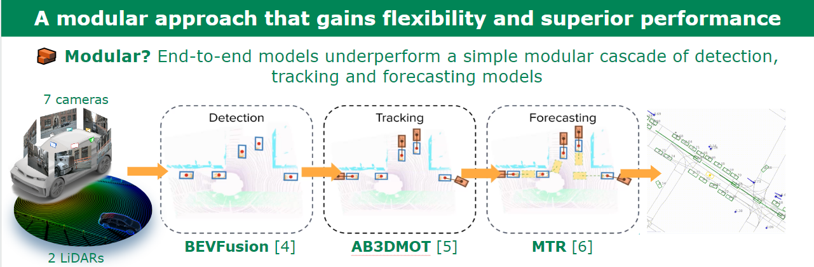

# Valeo4Cast: A Modular Approach to End-to-End Forecasting

[**Project**](https://valeoai.github.io/publications/valeo4cast/) |
[**Paper**](https://arxiv.org/abs/2406.08113)

Winning solution to the "Unified Detection, Tracking and Forecasting" Argoverse 2 challenge @CVPR WAD 2024. Work accepted at ECCVW 2024 Road++.


🔥Powered by [Hydra](https://hydra.cc/docs/intro/), [Pytorch-lightinig](https://lightning.ai/docs/pytorch/stable/), and [WandB](https://wandb.ai/site), the framework is easy to configure, train and log.


## 🛠 Quick Start (adpoted from Unitraj)
0. Create a new conda environment
```bash
conda create -n unitraj python=3.9
conda activate unitraj
```

1. Install UniTraj:
```bash
git clone https://github.com/valeoai/valeo4cast.git
cd UniTraj/unitraj
pip install --no-cache-dir  -r requirements.txt
pip install  --no-cache-dir torch==2.0.1+cu118 torchvision==0.15.2+cu118 --index-url https://download.pytorch.org/whl/cu118
pip setup.py develop
```
Known issues and solutions:

* Make sure to have the compiled knn_cuda.cpython-39-x86_64-linux-gnu.so in `./UniTraj/unitraj/models/mtr/ops/knn` Otherwise, it means that the command python setup.py develop didn’t work well when install UniTraj

* if you have path issue when running 'train.py' or 'predict.py', you can try to insert the absolute path of unitraj and `./UniTraj/unitraj/models/mtr/ops/knn` at the beginning of 'train.py' and 'predict.py

2. Install ScenarioNet:
```bash
cd UniTraj
pip install --no-cache-dir "metadrive-simulator>=0.4.1.1"
cd ./scenarionet
sudo apt-get update
sudo apt install libspatialindex-dev
pip install --no-cache-dir -e .
```

3. Install tracking code dependencies
```bash
# Argoverse2 devkit
sudo apt-get install -y curl
curl --proto '=https' --tlsv1.2 -sSf https://sh.rustup.rs | bash -s -- -y
export PATH=$HOME/.cargo/bin:$PATH
rustup install 1.76.0
rustup default nightly-2024-02-04
pip install --no-cache-dir git+https://github.com/argoverse/av2-api#egg=av2
pip install --no-cache-dir git+https://github.com/JonathonLuiten/TrackEval.git
sudo apt-get update
pip install --no-cache-dir filterpy # for ab3dmot
pip install --no-cache-dir lap # for ab3dmot
```

4. Install submission evalai api
```bash
sudo apt-get update
sudo apt-get install libxml2-dev libxslt1-dev
sudo pip install --no-cache-dir lxml
sudo pip install --no-cache-dir "evalai"
```


## Unitraj Code Structure (for forecasting)
There are three main components in UniTraj: dataset, model and config.
The structure of the code is as follows:
```
unitraj
├── configs
│   ├── challenge_config_noisy_train.yaml
│   ├── challenge_config_noisy_val.yaml
│   ├── challenge_config_noisy_test.yaml
│   ├── method
│   │   ├── autobot.yaml
│   │   ├── MTR.yaml
│   │   ├── wayformer.yaml
├── datasets
│   ├── base_dataset.py
│   ├── autobot_dataset.py
│   ├── wayformer_dataset.py
│   ├── MTR_dataset.py
├── models
│   ├── autobot
│   ├── mtr
│   ├── wayformer
│   ├── base_model
├── utils
```
There is a base config, dataset and model class, and each model has its own config, dataset and model class that inherit from the base class.

## From Tracking to Forecasting
The following tutorial will guide you how to perform tracking, forecasting with our method starting from a detection result `.feather`.

### 0. Download Argoverse2 Sensor dataset
Download the [Argoverse2 Sensor Dataset](https://www.argoverse.org/av2.html#download-link) and organize the dataset as follows:
```
argoverse2_sensor
├── train
│   ├── 2c652f9e-8db8-3572-aa49-fae1344a875b #scene id
│   │   │── annotations.feather   # ground-truth annotation, not used in E2E forecasting
│   │   │── calibration # not used
│   │   │── city_SE3_egovehicle.feather # ego car information
│   │   │── map # map information, e.g., HD maps
│   │   │── sensors # snesor data: lidar and cameras, for detection and tracking
│   ├── 02678d04-cc9f-3148-9f95-1ba66347dff9 
│   ├── ...
├── val
...
├── test
...
```
### 1. Tracking
We provide the detection results in the github release `data/det/detection_[train]/[val]/[test].feather`, they follow the `.feather` format described in https://github.com/argoverse/av2-api/blob/main/tutorials/object_detection_evaluation.ipynb

option 1 (single-worker):
```bash
cd valeo4cast/tracking/ab3dmot_track
# train set
python pub_test.py --work_dir=./SAVEFOLDER --checkpoint=[YOUR DET FILE .feather] --ego_coord --version=train

# validation set
python pub_test.py --work_dir=./SAVEFOLDER --checkpoint=[YOUR DET FILE .feather] --ego_coord --version=val

# test set
python pub_test.py --work_dir=./SAVEFOLDER --checkpoint=[YOUR DET FILE .feather] --ego_coord --version=test
```
Option 2 (multi-worker, by chunks), the following example shows running in 30 chunks:
```bash
for i in {0..29}
do
  python pub_test_V2.py --work_dir=./SAVEFOLDER --checkpoint=[YOUR DET FILE .feather] --ego_coord --version=train --chunks=30 --worker=$i &&
  python pub_test_V2.py --work_dir=./SAVEFOLDER --checkpoint=[YOUR DET FILE .feather] --ego_coord --version=val --chunks=30 --worker=$i &&
  python pub_test_V2.py --work_dir=./SAVEFOLDER --checkpoint=[YOUR DET FILE .feather] --ego_coord --version=test --chunks=30 --worker=$i
done
```
This will save all chunks in `./tmp`, to merge them:
```bash
python pub_test_V2.py --work_dir=./SAVEFOLDER --checkpoint=[YOUR DET FILE .feather] --ego_coord --version=train --chunks=1 --worker=0 &&
python pub_test_V2.py --work_dir=./SAVEFOLDER --checkpoint=[YOUR DET FILE .feather] --ego_coord --version=val --chunks=1 --worker=0 &&
python pub_test_V2.py --work_dir=./SAVEFOLDER --checkpoint=[YOUR DET FILE .feather] --ego_coord --version=test --chunks=1 --worker=0
```
A `[train/val/test]_tracking.pkl` will be saved in `./SAVEFOLDER` for each of the split. 

An extra linear interpolation step is added:
```bash
cd valeo4cast/tracking/ab3dmot_track
python interpolation.py # you should modify the pkl_path inside, to the location of your tracking pkl.
```
This will generate `[train/val/test]_tracking_interpolated.pkl` (the result is @10Hz, if you want @2Hz, just modify the sub_sample_ratio in interpolation.py), they will be used in the following step. If you want to skip this step, you can find our generated tracking pkls in the github release `data/track/[train/val/test]_tracking.pkl`

### 2. Generate scenarionet data for forecasting
We modified the scenarionet code (mainly `scenarionet/converter/argoverse2/utils.py`) to process Argoverse2 **Sensor** data, **given predicted tracking results**.

(1) put the tracking pickles under `scenarionet/converter/argoverse2/` with names as `[train/val/test]_tracking.pkl`.

(2) run
```bash
#train
python -m scenarionet.convert_argoverse2 -d PATH2SAVE --raw_data_path ROOTPATH/argoverse2_sensor/train/
#val
python -m scenarionet.convert_argoverse2 -d PATH2SAVE --raw_data_path ROOTPATH/argoverse2_sensor/val/
#test
python -m scenarionet.convert_argoverse2 -d PATH2SAVE --raw_data_path ROOTPATH/argoverse2_sensor/test/

```
The code will generate [scenarionet](https://metadriverse.github.io/scenarionet/) format data. If you want to skip step 0 and 1, we provide the generated scenarionet format data in the github release: `data/scenarionet_files/for_training.zip` and `data/scenarionet_files/for_val_and_test.zip`

### 3. Forcasting using MTR implemented with Unitraj
UniTraj uses [Hydra](https://hydra.cc/docs/intro/) to manage configuration files.

Universal configuration file is located in `unitraj/config/challenge_config_noisy_[train/val/test].yaml`.
Each model has its own configuration file in `unitraj/config/method/`, for example, `unitraj/config/method/MTR.yaml`.

The configuration file is organized in a hierarchical structure, and the configuration of the model is inherited from the universal configuration file.

#### Configuration Example
Please refer to `unitraj/config/challenge_config_noisy_[train/val/test].yaml` and `method/mtr/MTR.yaml` for more details.

####  Train
We finetune from ground-truth trajectory pretrained model, on predicted inputs. The pretrained model can be found in the github release `pretrained_weights/trained_GT_0.86.pkl`. Please add the pretrained weight path to `pretrained:` in `unitraj/config/challenge_config_noisy_train.yaml`

then run
```bash
cd UniTraj/unitraj
python train.py --config-name=challenge_config_noisy_train.yaml
```
(The first time running the code will generate the cache for the scenarionet files, currently it does not support multi-gpu, you may set in the config file `devices: [0]` for the caching process, otherwise the default number of GPUs for training is `devices: [0,1,2,3,4,5,6,7]`.)

During the training, the best checkpoint and log files will be saved in `unitraj/lightning_logs/`, we provide the trained weight in the github release `pretrained_weights/checkpoint_for_val_test.ckpt`.

####  Inference on val and test sets
please indicate the trained model weight to `ckpt_path:` in `unitraj/configs/challenge_config_noisy_val.yaml` and `unitraj/configs/challenge_config_noisy_test.yaml`, and indicate the data path for va and test in  `val_data_path:`

then run 
```bash
cd UniTraj/unitraj
python predict.py --config-name=challenge_config_noisy_[val/test].yaml
```
The results will be cached to `val_data_path` indicated in the config files, with name `output_MTR`, we need to merge them to generate submittable pickle file. To do that, run:
```bash
cd UniTraj/unitraj
python prepare_submission.py #please do not forget to modify the path inside the python file
```

The submittable file is saved in the scenarionet file path, we also perform a post processing step:
```bash
cd UniTraj/unitraj
python post_processing_files.py --pickle_file=Path2PklFromPreviousStep #please do not forget to modify the path inside the python file
```
It has the same name as the input pickle_file but with `_processed` tag in the end. Now you're ready to submit/evaluate your results!


### 3. Evaluation
Run
```bash
cd UniTraj/unitraj
python eval_forecaster.py --pred_path=Path2Pkl ----datadir=PathAV2Sensor --split [train/val/test]
```

### 4. Results
We provide the forecasting results for both the validaiton and test set, you can find them in the github release: `results/forecasting/test.pkl` and `results/forecasting/val.pkl` 

### For citation:
```
@article{xu2024valeo4cast,
  title={Valeo4Cast: A Modular Approach to End-to-End Forecasting},
  author={Xu, Yihong and Zablocki, {\'E}loi and Boulch, Alexandre and Puy, Gilles and Chen, Mickael and Bartoccioni, Florent and Samet, Nermin and Sim{\'e}oni, Oriane and Gidaris, Spyros and Vu, Tuan-Hung and others},
  journal={arXiv preprint arXiv:2406.08113},
  year={2024}
}
```
